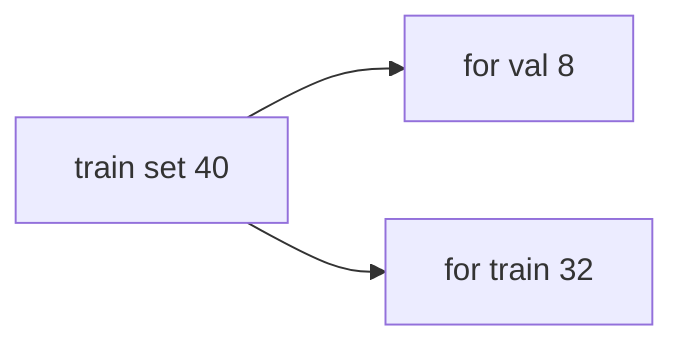
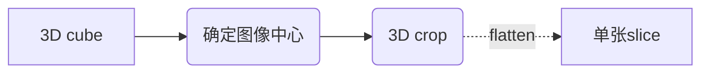
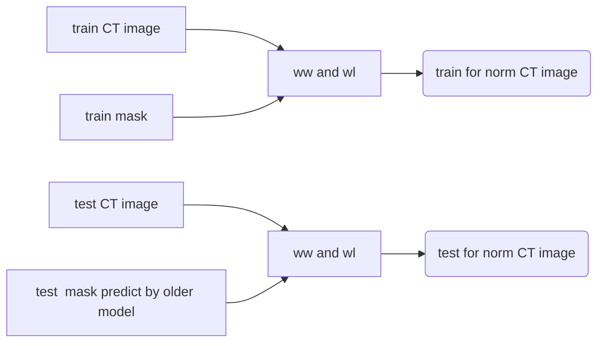
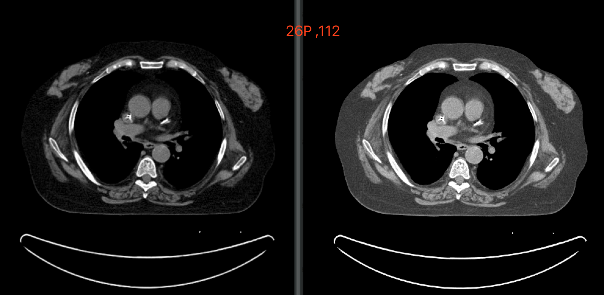
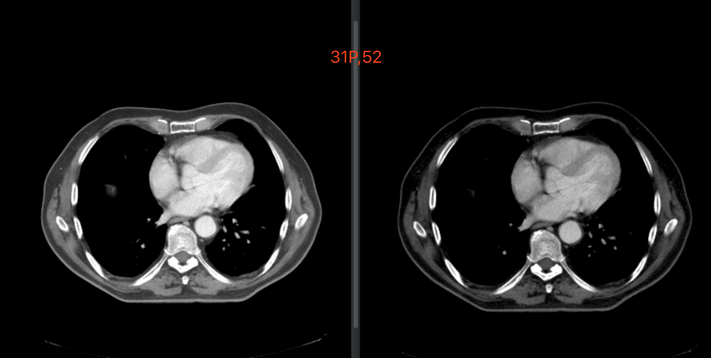

# segthor for keras

 >比赛网址 for more information： https://competitions.codalab.org/competitions/21012  
 
 

## label
标签| value | nickname
:--:|:--:|:--:
食管 | 1 | red
心脏 | 2 | pink 
气管 | 3 | yellow
动脉| 4 | blue

## 最后一次的提交结果：

时间 | 食管 | 心脏 | 气管 | 主动脉  
:---:|:---:|:---:|:---:|:---:
3月17日 | 0.8452（第五名）|0.9328（第十八）|0.9039（第十四）|0.9115（第十六）|  
3月22日 | 0.8513（第七名）|0.9457（第九名）|0.9083（第十五）|0.9175（第二十四）|

--   
目前有优于以上的成绩的模型。

## 各个任务的相关实验数据 ：  
食管：  [RED](http://gitlab.ai.chuangxin.com/wanglixin/segthor/wikis/%E5%99%A8%E5%AE%98/RED )   
心脏：  [PINK](http://gitlab.ai.chuangxin.com/wanglixin/segthor/wikis/%E7%8E%8B%E7%AB%8B%E6%96%B0/pink  )  
气管：  [YELLOW](http://gitlab.ai.chuangxin.com/wanglixin/segthor/wikis/%E9%83%91%E5%B0%91%E6%9D%B0/yellow  )  
主动脉： [BLUE](http://gitlab.ai.chuangxin.com/wanglixin/segthor/wikis/%E7%A7%A6%E6%99%8B/blue  )  
  

# Data understanding

## Example Pic

    
    

        <em>example</em>
    

## Training & Testing Data
The whole SegTHOR dataset (60 patients and 11084 slices) has been randomly split into:

- a training set: 40 patients, 7390 slices
- a testing set: 20 patients, 3694 slices

# Train
## Seg  and cls mdoel
Inference  https://github.com/qubvel/segmentation_models

### Avaliable backbones:
| Backbone model      |Name| Weights    |
|---------------------|:--:|:------------:|
| VGG16               |`vgg16`| `imagenet` |
| VGG19               |`vgg19`| `imagenet` |
| ResNet18            |`resnet18`| `imagenet` |
| ResNet34            |`resnet34`| `imagenet` |
| ResNet50            |`resnet50`| `imagenet` `imagenet11k-places365ch` |
| ResNet101           |`resnet101`| `imagenet` |
| ResNet152           |`resnet152`| `imagenet` `imagenet11k` |
| ResNeXt50           |`resnext50`| `imagenet` |
| ResNeXt101          |`resnext101`| `imagenet` |
| DenseNet121         |`densenet121`| `imagenet` |
| DenseNet169         |`densenet169`| `imagenet` |
| DenseNet201         |`densenet201`| `imagenet` |
| Inception V3        |`inceptionv3`| `imagenet` |
| Inception ResNet V2 |`inceptionresnetv2`| `imagenet` |

## Data processing

### Data auto crop 

### Data normalization for CT 

效果图：

    
    
    

        <em>example</em>
    

